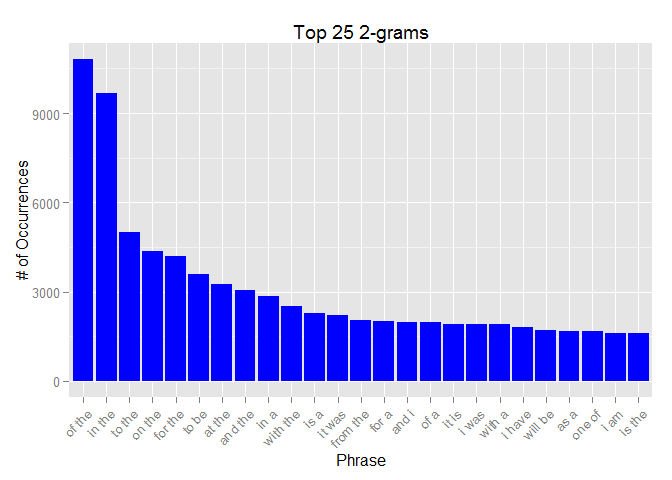

# Data Science Milestone Report
Luis Salazar  
Tuesday, July 21, 2015  

## Introduction

Next word predictor applications are interesting nowadays since often users want the next word to come up rather than typing it. For the next word to come up, a trained system is often used based on training corpora. For the present milestone report and the final app to develop, a corpus from HC Corpora (www.corpora.heliohost.org) will be used. The corpora consists of four locales en\_US, de\_DE, ru\_RU and fi\_FI, each with three files, LOCALE.blogs.txt, LOCALE.news.txt and LOCALE.twitter.txt, with LOCALE being one of the possible locales mentioned earlier. For proficiency and standarization en\_US will be used as the locale. Please refer to the readme file at http://www.corpora.heliohost.org/aboutcorpus.html for more details about the corpora.

## Initialization
Load required libraries and echo code used.

```r
library(tm)
library(RWeka)
library(stringi)
library(knitr)
library(ggplot2)
options(mc.cores = 4)
```
Should any of the libraries be missing, please issue:

```r
install.packages("tm")
install.packages("RWeka")
install.packages("stringi")
install.packages("knitr")
install.packages("ggplot2")
```

## Fetch data
Download the dataset file if needed, otherwise use the one available on the local folder.

```r
data_path <- './swiftdata'
swiftkey_dl <- function(){
    if(!file.exists(data_path)){
        dir.create(data_path)
        destUrl <- paste(data_path, "data.zip", sep = "/")
        sourceUrl <- "https://d396qusza40orc.cloudfront.net/dsscapstone/dataset/Coursera-SwiftKey.zip"
        download.file(sourceUrl, destUrl, method="curl")
        unzip(destUrl, exdir = data_path)
    }
}
swiftkey_dl()
corpus_path <- paste(data_path, "final", "en_US", sep = "/")
```

## Basic Analysis
Before looking at what are the frequencies of different n-grams, let's explore the corpus. It consists of 3 files in the order of hunderts of Megabytes, each with at least 30 Million words, and the largest char length is dependent on the type of corpora (e.g. twitter limits to 140 characters, blog limit may or not exist, and news entries are usually expected to be medium sized and long without particular limit).


```r
## Read the three raw corpora files
blogs <- readLines(file(paste(corpus_path,"en_US.blogs.txt",sep="/"), "rb"), encoding="UTF-8", skipNul = TRUE)
news <- readLines(file(paste(corpus_path,"en_US.news.txt",sep="/"), "rb"), encoding="UTF-8", skipNul = TRUE)
twitter <- readLines(file(paste(corpus_path,"en_US.twitter.txt",sep="/"), "rb"), encoding="UTF-8", skipNul = TRUE)

summary_corp <- data.frame(dataname = character(0), size = numeric(0), rows = numeric(0),  word_cnt = numeric(0), long_row = integer(0), stringsAsFactors = FALSE)

## Summary information for blogs
summary_corp[1,1] <- c("Blogs")
summary_corp[1,2] <- file.info(paste(corpus_path,"en_US.blogs.txt",sep="/"))$size/1024^2
summary_corp[1,3] <- length(blogs)/10^3
summary_corp[1,4] <- sum(stri_count(blogs,regex="\\S+"))/10^6
summary_corp[1,5] <- max(nchar(blogs))

## Summary information for news
summary_corp[2,1] <- c("News")
summary_corp[2,2] <- file.info(paste(corpus_path,"en_US.news.txt",sep="/"))$size/1024^2
summary_corp[2,3] <- length(news)/10^3
summary_corp[2,4] <- sum(stri_count(news,regex="\\S+"))/10^6
summary_corp[2,5] <- max(nchar(news))

## Summary information for twitter
summary_corp[3,1] <- c("Twitter")
summary_corp[3,2] <- file.info(paste(corpus_path,"en_US.twitter.txt",sep="/"))$size/1024^2
summary_corp[3,3] <- length(twitter)/10^3
summary_corp[3,4] <- sum(stri_count(twitter,regex="\\S+"))/10^6
summary_corp[3,5] <- max(nchar(twitter))

colnames(summary_corp) <- c("Corpus Data", "Size (MB)", "# of Rows (x10^3)", "# of Words (x10^6)", "# Chars @ longest row")

kable(summary_corp, digits=5)
```


Corpus Data    Size (MB)   # of Rows (x10^3)   # of Words (x10^6)   # Chars @ longest row
------------  ----------  ------------------  -------------------  ----------------------
Blogs           200.4242             899.288             37.33413                   40833
News            196.2775            1010.242             34.37253                   11384
Twitter         159.3641            2360.148             30.37358                     140

Due to the fact that the whole data set is over 500 MB, may contain special characters, abbreviations, bad words, etc, cleaning will be needed into a sample data, which will be the reference from here on.

## Cleaning and Filtering data
Before cleaning and performing other operations, we subset the data to 25k entries for blogs, news and twitter.


```r
set.seed(123)
blogs_sampled <- blogs[sample(1:length(blogs),25000)]
news_sampled <- news[sample(1:length(news),25000)]
twitter_sampled <- twitter[sample(1:length(twitter),25000)]
writeLines(c(blogs_sampled,news_sampled,twitter_sampled), paste(data_path,"en_US.sampled.txt",sep="/"))

## Summary information for sample
sampled <- readLines(file(paste(data_path,"en_US.sampled.txt",sep="/"), "rb"), encoding="UTF-8", skipNul = TRUE)
summary_samp <- data.frame(dataname = character(0), size = numeric(0), rows = numeric(0),  word_cnt = numeric(0), long_row = integer(0), stringsAsFactors = FALSE)
summary_samp[1,1] <- c("Sampled")
summary_samp[1,2] <- file.info(paste(data_path,"en_US.sampled.txt",sep="/"))$size/1024^2
summary_samp[1,3] <- length(sampled)/10^3
summary_samp[1,4] <- sum(stri_count(sampled,regex="\\S+"))/10^6
summary_samp[1,5] <- max(nchar(sampled))

colnames(summary_samp) <- c("Corpus Data", "Size (MB)", "# of Rows (x10^3)", "# of Words (x10^6)", "# Chars @ longest row")

kable(summary_samp, digits=5)
```


Corpus Data    Size (MB)   # of Rows (x10^3)   # of Words (x10^6)   # Chars @ longest row
------------  ----------  ------------------  -------------------  ----------------------
Sampled         12.10359                  75              2.21675                    5385

After the sampling is done and the samples combined, the resulting file is in the order of 10MB, with around 2M words and longest row of 5k words. This file will be cleaned and used in the remaining analysis.

In order to clean up the file, I consider the following steps:

1. Change to lower case
2. Remove tags (#,@)
3. Remove web URIs
4. Limit consecutive characters to 2
5. Remove punctuation
6. Remove bad words with a common profanity filter
7. Remove common slang words
8. Remove numbers
9. Remove unnecessary spaces
10. Transform to plain text


```r
## Remove non graphical characters and load list of slang and profane words
sampled <- sub("[^[:graph:]]"," ",sampled) ## Remove non graphical characters
slang <- readLines("slang.txt", encoding="UTF-8", warn=FALSE, skipNul=TRUE)
profanity <- readLines("profanity.txt", encoding="UTF-8", warn=FALSE, skipNul=TRUE)

# Clean dataset
toSpace <- content_transformer(function(x, pattern) gsub(pattern, " ", x))

sampled_clean <- VCorpus(VectorSource(sampled))
```

```
## Warning: cerrando la conenexion 5 (./swiftdata/en_US.sampled.txt) que no
## esta siendo utilizada
```

```r
#Step 1 - Change to lower case
sampled_clean <- tm_map(sampled_clean, content_transformer(tolower))
#Step 2 - Remove tags (#,@)
sampled_clean <- tm_map(sampled_clean, toSpace, "(^|\\s)(#|@)[a-z0-9_]+")
#step 3 - Remove web URIs
sampled_clean <- tm_map(sampled_clean, toSpace, "((https?|ftp)://)?www\\.[a-z0-9]+\\.[a-z0-9.]{2,}")
#Step 4 - Limit consecutive characters to 2
sampled_clean <- tm_map(sampled_clean, content_transformer(function(x) gsub("([a-z0-9])\\1+", "\\1\\1", x)))
#Step 5 - Remove punctuation
sampled_clean <- tm_map(sampled_clean, removePunctuation)
#Step 6 - Remove slang
sampled_clean <- tm_map(sampled_clean, removeWords, slang)
#Step 7 - Remove bad words
sampled_clean <- tm_map(sampled_clean, removeWords, profanity)
#Step 8 - Remove numbers
sampled_clean <- tm_map(sampled_clean, removeNumbers)
#Step 9 - Remove unnecessary spaces
sampled_clean <- tm_map(sampled_clean, stripWhitespace)
#Step 10 - Transform to plain text
sampled_clean <- tm_map(sampled_clean, PlainTextDocument)

# Save the corpus
saveRDS(sampled_clean, file = "en_US.corpus.rds")
```

I considered not to remove stop words nor stem them as they may provide a difference when predicting the next word.

## Tokenization and N-grams
As a step to be able to predict the next word, the cleaned corpus needs to be tokenized and several n-grams (sequence of n words) collected. At the time of writting this report the 1-Gram, 2-Gram and 3-Grams will be computed, though for much better accuracy in the final application, higher order n-grams (4-Gram,5-Gram,etc) will be obtained as well.


```r
## Read the corpus and create a data frame with it
final_corpus <- readRDS("en_US.corpus.rds")
corpus_df <-data.frame(text=unlist(sapply(final_corpus,`[`, "content")), stringsAsFactors = FALSE)

## Function to derive n grams
ngramTokenizer <- function(corpus, ngrams) {
  ngramRes <- NGramTokenizer(corpus, Weka_control(min = ngrams, max = ngrams, delimiters = " \\r\\n\\t.,;:\"()?!"))
  ngramRes <- data.frame(table(ngramRes))
  ngramRes <- ngramRes[order(ngramRes$Freq, decreasing = TRUE),]
  colnames(ngramRes) <- c("Phrase","Ocurrence")
  return(ngramRes)
}

# Compute unigrams and store them on a file, for re-use
unigrams_df <- ngramTokenizer(corpus_df, 1)
saveRDS(unigrams_df, file = "unigrams.rds")

# Compute bigrams and store them on a file, for re-use
bigrams_df <- ngramTokenizer(corpus_df, 2)
saveRDS(bigrams_df, file = "bigrams.rds")

# Compute trigrams and store them on a file, for re-use
trigrams_df <- ngramTokenizer(corpus_df, 3)
saveRDS(trigrams_df, file = "trigrams.rds")
```

Having the n-grams calculated, the most common n-gram phrases are depicted in the following plots.

```r
plot_ngrams <- function(ngram_df, ngrams) {
  ggplot(ngram_df[1:25,], aes(x = reorder(Phrase, -Ocurrence), y = Ocurrence)) + 
    geom_bar(stat = "Identity", fill = "Blue") +
    ggtitle(paste("Top 25",paste(ngrams,"grams",sep="-"),sep=" ")) + xlab("Phrase") + ylab("# of Occurrences") +
    theme(axis.text.x = element_text(angle = 45, hjust = 1))
}
```


```r
## Plot of the top 25 unigrams
plot_ngrams(unigrams_df,1)
```

 

```r
## Plot of the top 25 bigrams
plot_ngrams(bigrams_df,2)
```

 

```r
## Plot of the top 25 trigrams
plot_ngrams(trigrams_df,3)
```

 

The plots show mainly that the most frequent words one can encounter in the English language are "the" and "to", which will lead to common bigrams such as "in the", "to the", "of the", which could lead to more complex phrases either near terminal such as "in the movies", "to the market", "of the five", or that add on to more n-grams.

## Concluding remarks and next steps
The corpora used gave interesting results (ngrams) which will serve in the next word prediction app. At least two more levels of n-grams will be created for the final app. Furthermore in the building of the final app, more models will be investigated to evaluate or complement the accuracy and precision of the app. Finally, when the accuracy and precision is considered adequate, the application will be published.
